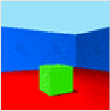

# 3dshapes - 3D Shapes dataset

This repository contains the 3D shapes dataset, used in 
[Kim, Hyunjik and Mnih, Andriy. "Disentangling by Factorising." In *Proceedings of the 35th International Conference on Machine Learning (ICML). 2018.*](http://proceedings.mlr.press/v80/kim18b.html)
to assess the disentanglement properties of unsupervised learning methods.

If you use this dataset in your work, please cite it as follows:
## Bibtex

```
@misc{3dshapes18,
  title={3D Shapes Dataset},
  author={Burgess, Chris and Kim, Hyunjik},
  howpublished={https://github.com/google-deepmind/3d-shapes/},
  year={2018}
}
```

## Description



3dshapes is a dataset of 3D shapes procedurally generated from 6 ground truth
independent latent factors. These factors are *floor colour*, *wall colour*, *object colour*,
*scale*, *shape* and *orientation*.

All possible combinations of these latents are present exactly once, generating N = 480000 total images.

### Latent factor values

*   floor hue: 10 values linearly spaced in [0, 1]
*   wall hue: 10 values linearly spaced in [0, 1]
*   object hue: 10 values linearly spaced in [0, 1]
*   scale: 8 values linearly spaced in [0, 1]
*   shape: 4 values in [0, 1, 2, 3]
*   orientation: 15 values linearly spaced in [-30, 30]

We varied one latent at a time (starting from orientation, then shape, etc), and sequentially stored the images in fixed order in the `images` array. The corresponding values of the factors are stored in the same order in the `labels` array.

The data is stored in a HDF5 file with the following fields:

*   `images`: (480000 x 64 x 64 x 3, uint8) RGB images.
*   `labels`: (480000 x 6, float64) Values of the latent factors.

## Download data file from Google Cloud Storage
You will first need to download the data from [Google Cloud Storage](https://console.cloud.google.com/storage/browser/3d-shapes). Click on this link and left-click the file `3dshapes.h5` to download it.

## Demo Jupyter Notebook

The repository includes a demo that shows how to load the dataset. You can open
the `.ipynb` file using [Jupyter notebook](http://jupyter.org/install.html),
with Python 2 installed. Make sure that the data file `3dshapes.h5` is located
at the directory where the notebook is running.


## Disclaimers

This dataset was created using the [Generative Query Networks Mujoco
environment](https://github.com/deepmind/gqn-datasets).
This is not an official Google product.


